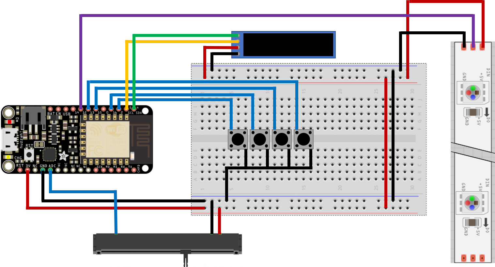
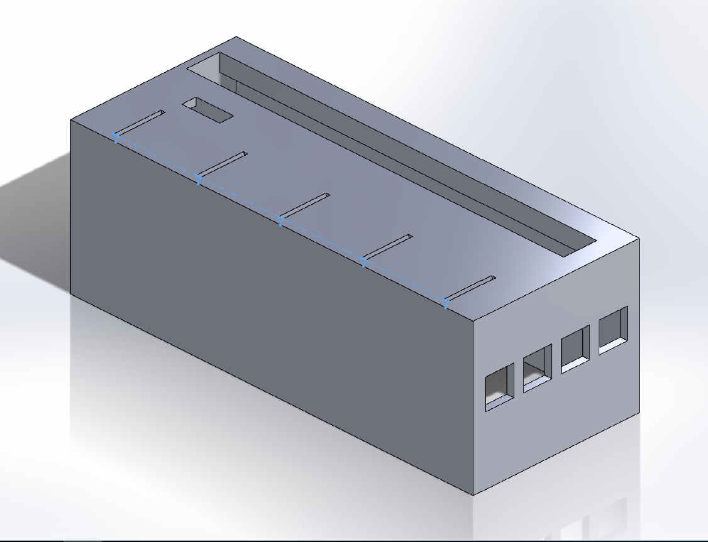
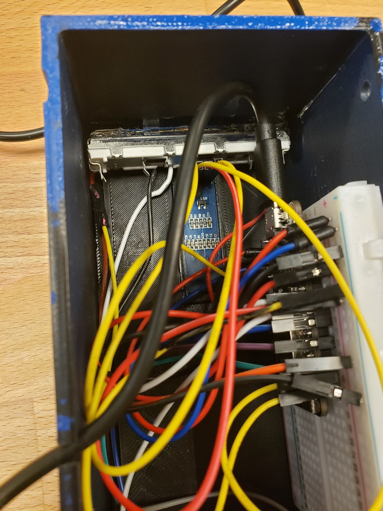
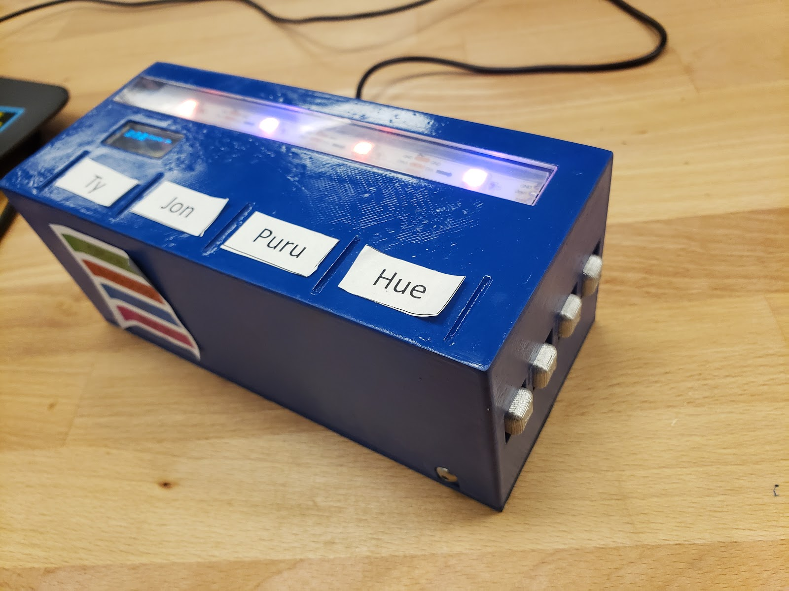

# Arduino-Transit
Brought up within the ENGiiNE team in Seattle Children's, the project was meant to solve an internal problem. As they gained new offices, it was hard to keep track of where everyone was, making communication more difficult. The ambient display was meant to be an easy way to keep track of everyone's location through self reporting. A online companion allowed for changing location while on the move, and added flexibility for future iterations. Those iterations could move into the hospitals for nurses navigating the complicated hallways.

This project started as something for Seattle Children’s, but grew into something more so that it could address the issues of climate change. It was originally a low impact idea that was meant for team management in a healthcare setting. By having nurses or other employees self-report their location from time to time, it would be easier to find them in the maze that is the hospital. While useful, the project became more meaningful when we asked ourselves what other solutions our platform could host. Keeping climate change in mind, we thought to address the commute problem that Seattle Children’s was trying to tackle. Despite initiatives geared towards reducing their carbon footprint, Seattle Children’s still had many people commuting in their personal vehicles. This was because the shuttles provided by Children’s were inconsistent. Seeing that as another problem that could be solved by our display, it became one of our focuses for design. This left us with two main objectives to complete in this project. The first was creating a display that would represent where people were within the hospital. The second was collecting transit data to make the shuttle time schedules more consistent. 

That took some doing. Not because displaying the information was hard, but because there was a lot of work that needed to be done behind the scenes. That being said, our project managed to complete our objectives almost to the letter. When it came to displaying location of people, we created a robust system that allowed location input both physically and over the internet. This hybrid approach allows for easy information sharing across multiple enclosures, with a minimum of calls. There was a lot of work on making a streamlined enclosure to house all of it, but ultimately it was relatively simple. Unfortunately, the same cannot be said about the transit data. The first problem was that real time data of the shuttles was not available to the public. Even APIs that had them recorded did not have any data besides where they stopped. Due to this, we had to shift to showing real time data for public transit between the hospital owned buildings. Although it is less convenient than the shuttles, by keeping tabs on the real time data we were able to make public transport a more consistent option. It took three different APIs and various data reading methods, but finally we were able to parse it to the point where we could display the data. With both of our objectives completed to the best of our ability, we were able to create something that could fit in on any workstation or computer on wheels at the hospital.

[Youtube video](https://youtu.be/vJwJYBlnk2w)

Link to io.adafruit.com [dashboard](https://io.adafruit.com/aylorob/dashboards/seattle-childrens-person-tracker). 

## Things Needed
1. Feather HUZZAH ESP8266 board
2. LED Strip
3. Buttons
4. OLED Display

## Libraries Required
1. ArduinoHttpClient by Arduino version 0.4.0
2. ArduinoJson by Benoit Blanchon version 6.11.0
3. Adafruit Unified Sensor by Adafruit version 1.3.4
4. Adafruit GFX Library by Adafruit version 1.5.3
5. Adafruit SSD1306 by Adafruit version 1.2.9
6. Adafruit NeoPixel by Adafruit version 1.2.3
7. Adafruit IO Arduino by Adafruit version 3.2.0
8. [Button Library](https://blogs.uw.edu/fizzlab/technology/libraries/buttonlib), download ButtonLib.zip, unzip then place folder in Arduino/libraries folder
9. [NTPClient](https://github.com/taranais/NTPClient), download as zip, unzip the folder, rename from NTPClient-master to NTPClient, move NTPClient folder to Arduino/libraries folder

## Configuration
Register for a free developer account from [Here](https://developer.here.com/documentation/transit/topics/what-is.html) to get keys for their Public Transit API. Visit [here](https://www.latlong.net) to get latitide and longitude information. Visit [wikipedia](https://en.wikipedia.org/wiki/List_of_UTC_time_offsets#UTC%E2%88%9207:00,_T) to get UTC time offsets to get current date and time. Visit [ArduinoJson](https://arduinojson.org/v6/assistant/) to get help resizing the buffer (const size_t capacity).

## Schematic

## CAD Model

## Final Look

